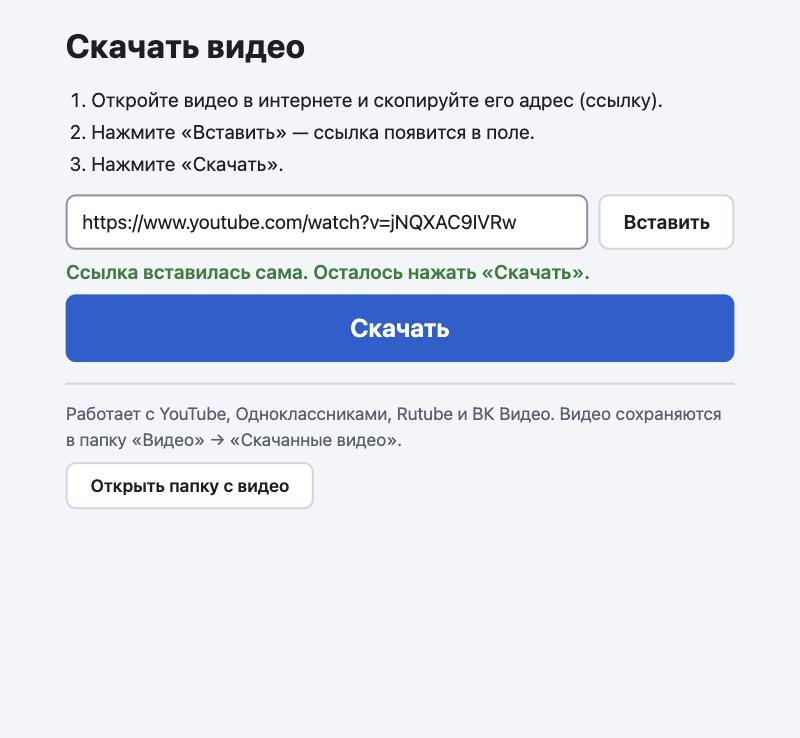
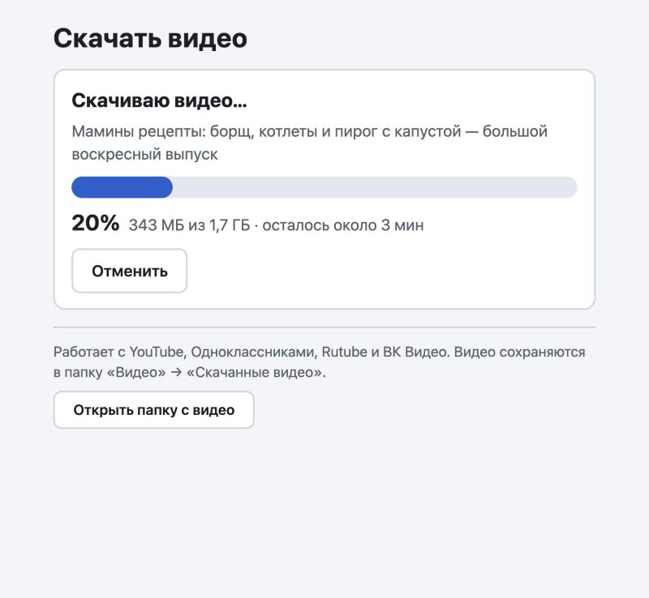
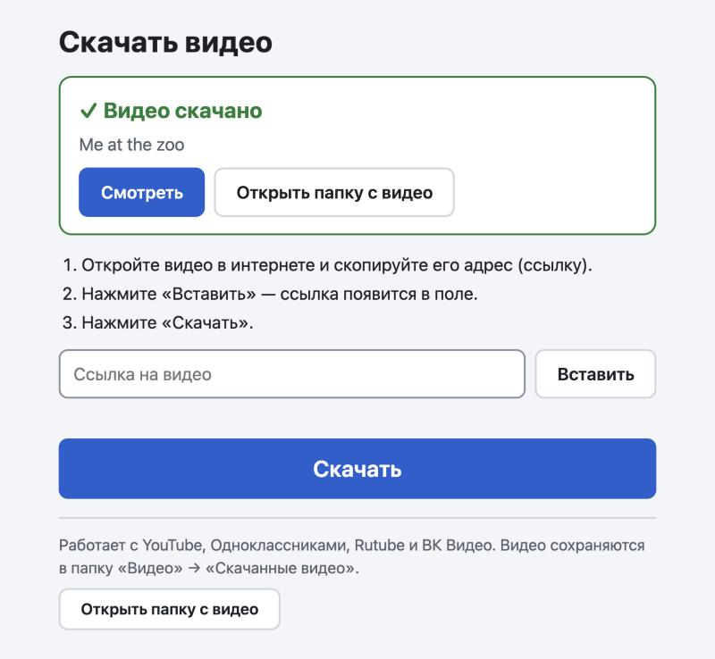

# Скачать видео

Программа для Windows, которая скачивает видео из интернета. Сделана для людей, которые плохо ладят с компьютером: скопировал ссылку, открыл программу, нажал «Скачать».

Работает с YouTube, Одноклассниками, Rutube, ВК Видео и остальными сайтами, которые понимает [yt-dlp](https://github.com/yt-dlp/yt-dlp).

| Ссылка вставляется сама | Скачивание | Готово |
| --- | --- | --- |
|  |  |  |

## Установка

1. Скачайте **[VideoDownloader-Setup.exe](https://github.com/dT0lkien/VideoDownloader/releases/latest/download/VideoDownloader-Setup.exe)** (около 100 МБ) и запустите.
2. Windows покажет синее окно «Система Windows защитила ваш компьютер» — установщик не подписан. Нажмите «Подробнее» → «Выполнить в любом случае».
3. Установка идёт сама, без вопросов и без прав администратора. На рабочем столе появится значок «Скачать видео».

Нужна Windows 10 или 11 (64-бит). Больше ничего ставить не надо: yt-dlp, ffmpeg и deno уже внутри установщика.

> **Статус.** Это первая версия. Логика, интерфейс и работа с настоящим yt-dlp проверены на macOS; на Windows программа пока не обкатана. Если что-то не работает — напишите в [Issues](https://github.com/dT0lkien/VideoDownloader/issues).

## Как пользоваться

1. Откройте видео в браузере и скопируйте его адрес.
2. Откройте «Скачать видео» — ссылка вставится сама (или нажмите «Вставить»).
3. Нажмите «Скачать».

Видео сохраняются в папку «Видео» → «Скачанные видео» в формате mp4 (до 1080p, h264 + aac — играет на телевизорах и телефонах).

## Что сделано для надёжности

- **yt-dlp обновляется сам** при каждом запуске (канал nightly). Если скачивание не удалось, программа обновляет его ещё раз и повторяет попытку — сайты меняются часто, и почти все поломки лечатся свежим yt-dlp.
- **Если антивирус удалил `yt-dlp.exe`**, программа скачает его заново.
- **Ошибки — по-русски и по делу:** «видео закрыто», «нет связи с сайтом», «закончилось место». Исходный текст yt-dlp спрятан под «Подробности для помощника».
- **«Отменить» и закрытие окна** останавливают yt-dlp вместе с ffmpeg и deno; недокачанное лежит отдельно и в папку с видео не попадает.
- **Второй раз программа не откроется** — двойной щелчок по значку покажет уже открытое окно.
- **Нет WebView2?** Та же страница откроется во вкладке браузера.
- Журнал для разбора проблем: `%LOCALAPPDATA%\VideoDownloader\log.txt`.

## Как устроено

Один exe на Go (~7 МБ, без Electron). Интерфейс — страница [ui.html](ui.html), которую программа отдаёт сама себе по `127.0.0.1` и показывает в окне WebView2 (он встроен в Windows 10/11). Скачивает [yt-dlp](https://github.com/yt-dlp/yt-dlp), склеивает видео со звуком ffmpeg, deno нужен yt-dlp для YouTube.

| Файл | Что в нём |
| --- | --- |
| [main.go](main.go) | Запуск yt-dlp, разбор его вывода, объяснение ошибок, локальный сервер |
| [os_windows.go](os_windows.go) | Окно, буфер обмена, остановка процессов — всё, что специфично для Windows |
| [os_other.go](os_other.go) | Заглушки для разработки на macOS/Linux |
| [ui.html](ui.html) | Интерфейс |
| [installer.nsi](installer.nsi) | Установщик (NSIS) |
| [build.sh](build.sh) | Сборка установщика |

## Сборка

На macOS или Linux; нужны Go, `makensis`, `curl` и `unzip`:

```bash
brew install go makensis
./build.sh
```

Скрипт скачает yt-dlp, ffmpeg и deno для Windows, прогонит тесты и соберёт `dist/VideoDownloader-Setup.exe`.

Для разработки без Windows: `go run .` печатает адрес страницы — откройте его в браузере (нужен установленный `yt-dlp`).

## Чужие компоненты в установщике

Исходный код в этом репозитории — под лицензией [MIT](LICENSE). Установщик дополнительно содержит неизменённые сборки:

| Компонент | Лицензия | Откуда |
| --- | --- | --- |
| yt-dlp | Unlicense | [yt-dlp/yt-dlp](https://github.com/yt-dlp/yt-dlp) |
| FFmpeg | GPLv3 | сборка [yt-dlp/FFmpeg-Builds](https://github.com/yt-dlp/FFmpeg-Builds), исходники — там же и на [ffmpeg.org](https://ffmpeg.org) |
| Deno | MIT | [denoland/deno](https://github.com/denoland/deno) |
| WebView2Loader.dll | BSD-подобная, Microsoft | из [jchv/go-webview2](https://github.com/jchv/go-webview2) |

Скачивайте только те видео, на которые у вас есть право.
